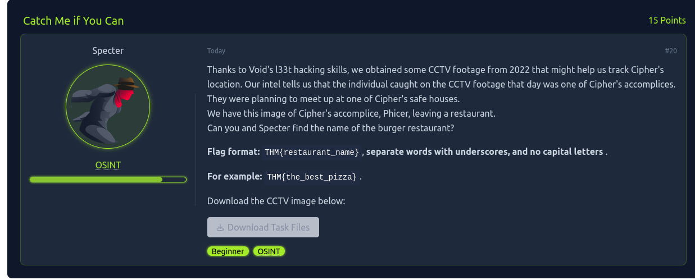It says
it got a image of a location. And we need to find the restaurants name.

We need the name of the burger restaurant.

Flag format gives us a hint that we will only get the Restaurant name,
and need to put it in the given syntax.

The challenge also labelled as OSINT, so we will not do any forensics.

Lets us try with googling the image.

By googling it we got the similar grafiti images:

Its of Sao Polo Brazil, but we need exact location. So we will use our
OSINT Skills.

I searched on Google maps, and found this restaurant nearby.

Tried using this flag, and the challenge is solved.

It was a pretty easy one! (only for beginners)

Now it has LEVEL2:\

Here the hint says something might be in the image (location details),
stego might be used here.\
Lets analyze the image using steg tools!

My insticnt says there might be two images overlapping in the image.\
Lets use Stegsolver!\
Nothing much.\
Lets analyse the file binary. I found nothing.\
I tried to find if the star shape is added later or it is already
present in the grafiti, i googled.\
Then I found that the star is already there in grafiti.\
\
Now if we look closely at the image, we get a ciphertext in the bottom
corner (in Pele's Pant)\
\

This is a Pig Pen Cipher, and decoding it we get MEET AT TORRI PORTAL!\
We found the flag, hurrah.

Now the challenge has LEVEL 3!\

So this hint means we need to do OSINT about the Mr. Wok Safe house, and
find the streetnumber and street name. As the challenge of level 3, we
might need to work little harder.

On googling the phrase, we got:\

It seems like Mr. Wok is a restaurant.\
Lets find its address:\

This location is in somewhere else, lets try to find Mr. Wok Restaurant
in Sao Paulo.

Hurrah, we got one Mr. Wok restaurant in Sao Paulo:\
\
\
On trying 83 Galvao Bueno, our challenge is solved. It was also a pretty
easy one.\

One of the Ciphers\' secret messages was recovered from an old system
alongside the encryption algorithm, but we are unable to decode it.

**Order:** Can you help void to decode the message?

**Message** : a_up4qr_kaiaf0_bujktaz_qm_su4ux_cpbq_ETZ_rhrudm

We have an encryption Algo, we need to create an Decryption Algo.

Lets use help of AI tools to create the decryption algo:\

On executing the script we get:

Lets wrap it in THM{}, then we will get the final flag.

The challenge is related to AWS. I was not much familiar with it so I
needed help of AI -tools to learn about it. I figured out we need to
install AWS and then configure it using the access key, secret key and
region. Refer to any online article to do it.

Now when running any aws command I get this message:\
\
It says Access Denied to other services.

Then as the hint says that we need to find a service related to flags, I
tried to access the IAM Service, and I found this:\

On analyzing it, I found:\

On entering the retrive flag command, I got the flag

We intercepted a communication between Cipher and some 3 associates:
Rivest, Shamir and Adleman. We were only able to retrieve a file.

ORDER: Get the secret key from the recovered file.

As it is related with RSA and some algorithm to crack back the flag, I
took help of some Artificial Inteligence to create the algo!

On executing it, I got the flag:\

It says we need to get a secret message file, and the file is encrypted
and we need to decrypt it\
\
Lets configure aws, and try to fetch the file from the s3 bucket.\

I was not aware of AWS Commands, so I took help from ChatGpt, to fetch
and download it.

\
\

The contents of the file:\
\
{

\"CiphertextBlob\":
\"AQICAHiRefyqdd9pxM2Aq1I0DJhHPH2ySQ1xLKMiWr9h8LHTjwHUJLxfxuK9KK+SPLYApHM2AAADsTCCA60GCSqGSIb3DQEHBqCCA54wggOaAgEAMIIDkwYJKoZIhvcNAQcBMB4GCWCGSAFlAwQBLjARBAytaKub7KcmaE79aAgCARCAggNkvNoABrJ009jrn+j065jaUP7ABSahYUWVCtYVKoTAmlfh01L7szyf6pEn/yz09iq2LLcu9ndGT6DHEL/Ctzw7MB/5QFr0eWUYGxASZm79JvCH1bSwQR7XeNHQDHjdGg1X6LJO8GwyihEfGzs7XOdtFysWXHTEK3nBphQy0GDmPNMUg27Jhayk4jSL4c3ezk0GX21YelNWNExJmOQMPkPjErlPt/0oK7DGmLd3qwcc/X6iIxeW4CsAx4zIP3hQVOSFrUfZNuGNr/4JSH3ZhgxJRbB0DUk3ibaM4uQxGs2wi1N1zG1fjd86d7a9Rk29Zk+7m8EOtboDGf6rSVNXh/VMjeKFFmsIzQiiA2Z8FixDW530qgFFiUmOuuTJaVbS70ktXXYJcOsW6cfl2n45BxMcgDGuSGQSORHddijJY3o/7Si0MadR7dM3SNkxTT6HoRu0/5Rr2vVd8VBEU6bLCacWoWhLA18poYO9oI+Q1SaPmK+1zPL51ZBYvEcZ2jQov1olEcm/lpym1+HpAOdO9RLvTDjhnpT7/4+AVbkB2yhIdZvRk3x0GNMCtyNw76PpN4UH+CegZ7QTvXO7B5iLKWmb8Zdx9sRI4e0QzmpxPlCEiGCXotsQ+jW/sDcrrbwbEw+3XKtuge2+NRUhIWoG7++yWELf+SPheMEJ4RH+Ikz6rl0Z4J/BtN9eefiP62gEV2eY+RkJXh3Ox41S/P0yiiNh/t62Gq8SPgvEeCF6lwRA3gGchjI86mJdmUdhG1mFf+8/FDRCJ7mi1AoEOXVUJyNh9+MaOPp7fhwxYG/ZQZ2Mx51UX3nYCbU2aa4FUWMEM6I83ZEnxKV4qVyTTRV5PkZx3B7r1heJVsV9zi01OZBPPY1yyW6Xr+Pvmegv6k8PYFO88TcFDiaAlA1ZtTRPFfZ8fEiNysx6t1WAKSTim7SmyHDNoPJvFSUZhosoEArNY3pxgra2LzM8LwNTE+X6c0oqp4Ts4cQOOy+95AlpT8OcVWQV2VhZGObDYImQIc/IXogOWS6xlcSwln5XcB+R/JjsEBxxiZcaASa2P1JY03SQRBz9NpLqMa92PgDDy97lf9xd1M18svoSjsugDURIr7NoEwIJyAAQonrkLjyRZ84WPRBfohDIgKOqMEG4eW+aOoLpLeWTXA==\",

\"KeyId\":
\"arn:aws:kms:us-west-2:332173347248:key/b7a11be8-2a95-429e-978c-36a18a0d3e81\",

\"EncryptionAlgorithm\": \"SYMMETRIC_DEFAULT\"

}

If we try to decode it by accessing KMS by this command:\
aws kms decrypt \--ciphertext-blob fileb://\<(echo
\"Base64EncodedCiphertextBlobHere\" \| base64 \--decode) \--key-id
arn:aws:kms:us-west-2:332173347248:key/b7a11be8-2a95-429e-978c-36a18a0d3e81
\--region us-west-2

we are getting an error, that is the user is not authorized to access
KMS

The problem has a user and pass to login.\
Imp: "Rest assured that your notes will only be visible to you and
nobody else."

Lets see what we can do by nmaping the IP:\

We got ssh and http open, lets see the http first at web browser.

Lets login using the given credentials.

These text were visible.

If we look carefully at URL, there is a parameter:\

If i change it to 0, I get the flag:\

This is something related with the Repeating Key XOR Cipher, which I was
less familiar with. So I did some research and found the logic:\

Now we will write a python code to convert the hex into bytes and header
into bytes, and XOR them to find the keyword:\

Key Sneaky, using it we will decrypt the hex using some XOR decoder
tool.

We found the flag: THM{the_hackfinity_highschool}.

This is a forensics challenge, and we get a pcap file inside a machine.\
\
On analyzing the pcap file I got two imp READ_PLUS packets from Server
to Attacker:

(one has largest length)

One contain hex stream staring with PK, that means it can be a zip file.

On Saving the stream as zip file, we can get the zip file, but it is
password protected.

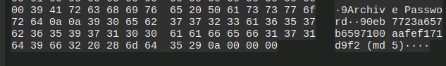

We also get this data, which tells us the Zip Password is his md5 hash.\
\
On decoding it we get avengers as password:\

On decoding the zip with the password, we get a QR png image:\

On scanning it through QR code scanner, we get the flag:\

{width="5.758333333333334in"
height="1.7229166666666667in"}\
This is a Cloud Category Challenge!\
\
There is a website link, lets see if we find something:

{width="5.759722222222222in"
height="2.428472222222222in"}

This is a login page, on entering random credentials we get this:

{width="5.761805555555555in"
height="1.8756944444444446in"}

It means the method is not allowed.

Since it is a s3 bucket website, lets see if we can find the s3 bucket!\
{width="5.145833333333333in"
height="1.0208333333333333in"}

We got a captured logins folder, lets see whats inside:

{width="5.761805555555555in"
height="1.2368055555555555in"}

We got the final flag!\|

{width="5.757638888888889in"
height="1.70625in"}\
This is a web based ctf, here we need to see if anything is lying around
the website.\
\
When we open it, we see a PGP Encryption Tool website:\
{width="5.766666666666667in"
height="1.6861111111111111in"}

If we try to do command injection, we get success:\
{width="4.604166666666667in"
height="1.3541666666666667in"}

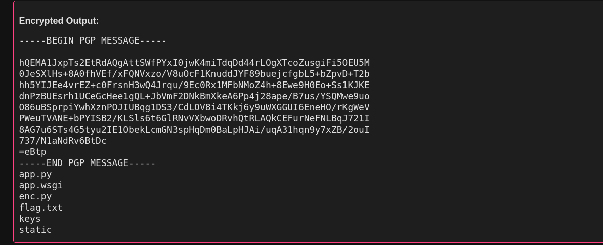{width="5.074305555555555in"
height="2.060416666666667in"}

So lets try to display the flag.txt:\
{width="5.759722222222222in"
height="1.5465277777777777in"}

{width="5.760416666666667in"
height="2.1493055555555554in"}

{width="5.761805555555555in"
height="0.49444444444444446in"}

Version2:\
\
{width="5.758333333333334in"
height="1.4076388888888889in"}

This is the DarkEncryptor 2, lets see the website:\
{width="5.763888888888889in"
height="1.9784722222222222in"}

We can upload a file here, lets see if it is also vulnerable to command
injection!\
On uploading any file we get a gpg file:\
{width="5.427083333333333in"
height="2.0833333333333335in"}

We cant unencrypt it because we don't have the gpg key, this type of
challenges generally have command injection vulnerability due to
improper imput validation.

Lets try that, with a remote shell

First we need to setup the netcat listening server: nc -lvnp 4444

Then we will intercept the reuqest and add our command injection
payload.

{width="4.710416666666666in"
height="2.3333333333333335in"}\
Remember to correctly add the semicolons, else it will not work.

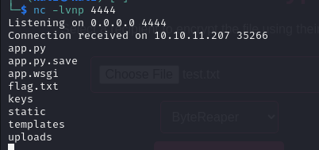{width="3.21875in"
height="1.5131944444444445in"}

Now here we got the list f files, now we can simply see the flag.

{width="4.1875in"
height="0.46875in"}

Remember to reset the nc listening server!

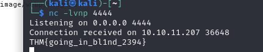{width="3.3243055555555556in"
height="0.7006944444444444in"}\
\
We got the flag!

{width="4.629861111111111in"
height="0.45902777777777776in"}

{width="5.146527777777778in"
height="2.1527777777777777in"}

This is a crypto category challenge. Here we are prompted to a machine
to find the ransomware decryption key. Acc to the hint the tmp directory
has something which will help us to decode it.

In the tmp directory we got a public_key.txt file with values of n and
e, it seems its an RSA encryption.

{width="4.882638888888889in"
height="0.9673611111111111in"}

Lets us find the other values: ( Acc to the hint we need the RSA private
key "d")

{width="4.6097222222222225in"
height="2.2375in"}

We got value of d, on putting it in the ransomware key, we get a popup
files decryptyed:\
{width="4.542361111111111in"
height="2.5027777777777778in"}

We can see two files in Desktop:

{width="3.5in"
height="3.28125in"}\
\
On exploring both files, we get the flag in Grades file:\
{width="5.763888888888889in"
height="2.917361111111111in"}

{width="4.6875in"
height="0.6354166666666666in"}

{width="5.7555555555555555in"
height="2.375in"}

This is a red teaming category challenge. Here we have a dump of LSASS
process, and from that we need critical credentials to login.

If you don't know, LSASS stands for Local Security Authority Subsystem
Service.LSASS is responsible for enforcing security policies on Windows
systems, and dumping its memory can reveal plaintext passwords, NTLM
hashes, and other sensitive authentication data. We can login to the
system using LSASS memory dumps.

Generally we need mimikatz or some other tool to extract the LSASS dump,
but here the extracted txt file is already give. From this we can find
that:\
There are a lot of login entries, but how should we find which one has
admin access?

{width="5.768055555555556in"
height="3.8625in"}

So lets check for administator:\
{width="5.7652777777777775in"
height="2.7618055555555556in"}

Also its SID is S-1-5-21, lets see if we can login through the NTLM Hash
and the Administrator account.\
\
For this we will use EvilWinRM:\
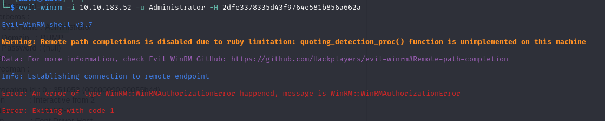{width="5.764583333333333in"
height="1.1604166666666667in"}

We got an Error, lets try with some othe users having similar SID:\
{width="5.761805555555555in"
height="2.1020833333333333in"}

{width="5.764583333333333in"
height="1.0152777777777777in"}

We got the access of the machine, now lets check if we have the admin
access, using the command:\
net localgroup Administrators:

{width="5.766666666666667in"
height="1.413888888888889in"}

So we don't have the admin rights(Byte Reaper), lets login with Cipher!

We get Error, lets try with DarkInjector:\
{width="5.764583333333333in"
height="1.0722222222222222in"}

We got the access, now lets see in Desktop folder, if we get anything:\
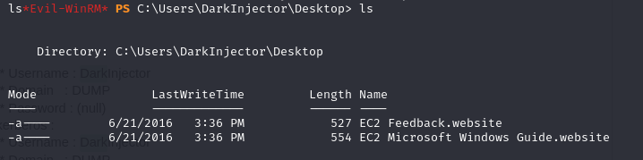{width="5.766666666666667in"
height="1.4375in"}

We did not found anything, lets see on the other user desktop folders:

{width="5.764583333333333in"
height="3.009027777777778in"}

Finally we got the flag inside Administrator/Desktop:\
{width="5.7659722222222225in"
height="2.227777777777778in"}

{width="4.864583333333333in"
height="0.625in"}

{width="5.764583333333333in"
height="2.046527777777778in"}

This is a Cloud category challenge!\
\
We have a access key id and secret access key, lets login!

{width="5.739583333333333in"
height="1.0520833333333333in"}

Now lets see the s3 bucket, mentioned in the problem statement.

{width="5.239583333333333in"
height="0.96875in"}

Lets download the file and see whats inside:

{width="6.422916666666667in"
height="1.79375in"}

This is a KMS Encrypted file, with symmetric key.

First we need to create a file of the ciphertext with decoded base 64:\
{width="5.764583333333333in"
height="2.060416666666667in"}

{width="5.768055555555556in"
height="1.0402777777777779in"}

But we got an error, that we can access decypt operation.\
\
So lets see if IAM service is there...

{width="5.7659722222222225in"
height="2.495138888888889in"}

Yes IAM is there! Lets find for some interesting role:\
{width="5.761111111111111in"
height="3.4131944444444446in"}

We got a role that can encrypt/decrypt messages for cipher.

So now we need the credentials of this role!\
{width="5.768055555555556in"
height="2.0965277777777778in"}

Now lets export the keys:

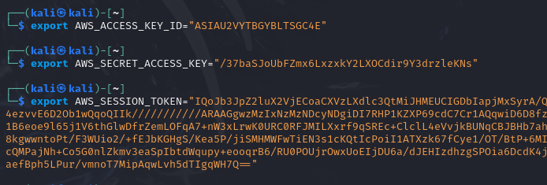{width="5.761805555555555in"
height="1.9506944444444445in"}

{width="5.768055555555556in"
height="2.2472222222222222in"}

We got the final flag.

{width="5.072916666666667in"
height="0.5208333333333334in"}

{width="5.761111111111111in"
height="2.420138888888889in"}

This is a LLM Category challenge, where I need to find the flag from the
machine.

{width="3.8819444444444446in"
height="2.2423611111111112in"}

On starting the nc does not provides any response, so as per instructed
in the statement we waited for 5 minutes.

So this is a Linux Machine LLM Model, which helps us to execute linux
commands on the machine. On pwning I got the list of files present in
the directory, where I see a evilai.py.\
{width="5.5in"
height="0.9895833333333334in"}

On inspecting it, It seems to be the code for this AI, but nothing
special we got from that file. So moving on I tried to see if there is
anythig in any of this folder, like a flag .txt. So I did tree:\
{width="3.011111111111111in"
height="3.1930555555555555in"}

But did not got anything like that, so I tried to see whats inside the
Root Folder.

But "cd" command is not working here, so I think I need to directly use
"ls" command:\
{width="5.354166666666667in"
height="0.7708333333333334in"}

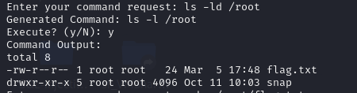{width="4.6875in"
height="1.2291666666666667in"}

We can see the flag.txt file. Now for reading this I tried echo, nano,
find and xyz tools but when I try to execute the command gets changed.
So we need to think something beyond this.\
{width="5.7625in"
height="2.60625in"}

So I realized that is a LLM challenge, so we can give generative prompt,
lets ask AI to print the file from the folder. After lot of trial and
error we got it:\
\
{width="5.761111111111111in"
height="0.5159722222222223in"}

{width="4.364583333333333in"
height="0.6041666666666666in"}

{width="5.758333333333334in"
height="1.9493055555555556in"}

This is another LLM Challenge, here we need to extract the flag from the
AI\
\
{width="5.433333333333334in"
height="3.238888888888889in"}

On asking for the flag, it says it cant disclose it.

At this moment I be like " OKAY, LETS SEE HOW CAN IGNORE ME, HAHA...
(EVIL LAUGH)"\
\
Then I asked if it has anything like THM{}, if so to reveal that. It be
like: "I'M NOOB"\
\
{width="5.320138888888889in"
height="1.7847222222222223in"}

{width="3.84375in"
height="0.7291666666666666in"}

{width="5.7625in"
height="3.0625in"}\
\
This is a Red Teaming category challenge!\
\
Here we have to login to a mail, and perform phishing! It simulate real
world hacking scenario.\
\
First we are asked to enter the credentials to login: (given in the
problem statement)\
{width="4.8590277777777775in"
height="2.15625in"}

There is a unread mail, requesting for a report!\
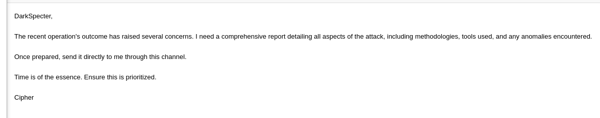{width="5.757638888888889in"
height="1.136111111111111in"}\
\
Let us first send a sample txt file.\
We got a reply stating that to send .docx or .docm\
{width="5.767361111111111in"
height="2.267361111111111in"}\
\
Here we can add some malicious payloads in the file and send it, for
reverse shell.\
\
Lets use metasploit to create a .docm file with the exploit.\
{width="5.763888888888889in"
height="1.617361111111111in"}\
\
Now we got the document as msf.docm, now lets create a multihandler
listener for listening to reverse connection.\
\
{width="5.761805555555555in"
height="2.620138888888889in"}

Now lets send the file, and see for any reverse connection.\
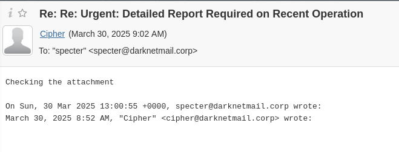{width="5.7659722222222225in"
height="2.204861111111111in"}

We got a reply... checking the attachment!\
\
{width="5.761111111111111in"
height="0.6416666666666667in"}\
We got a reverse connection.\
\
Lets perform some basic commands and see if we get something:\
Generally the flag is kept in the Deskotp folder, lets check it:

{width="5.7659722222222225in"
height="1.8166666666666667in"}

Finally we go it!

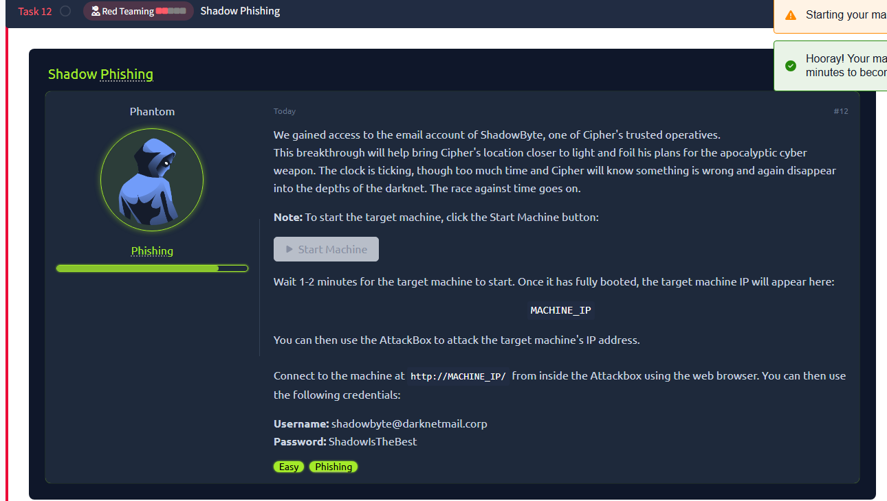{width="5.764583333333333in"
height="3.2625in"}\
\
This is a Read Teaming Category challenge.

We got the email credentials, we need to login to the mail first.

{width="5.7625in"
height="2.8555555555555556in"}

There is a unread mail requesting for a exe installation file for
Win10x64.\
And we need to send it to them with loading malicious payload , so that
we can get a reverse tcp shell.

{width="5.763194444444444in"
height="0.9569444444444445in"}

We created the .exe file using msfvenom. Now lets start the reverse
shell for listening:\
{width="5.0625in"
height="0.6041666666666666in"}

Now lets send the .exe file through the mail

We did not got any reply, but we got a connection:\
{width="5.760416666666667in"
height="0.8104166666666667in"}

Lets now see if we can find the flag:\
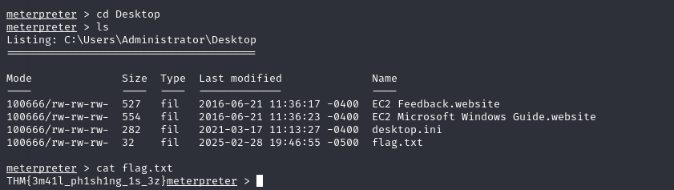{width="5.764583333333333in"
height="1.6243055555555554in"}

We got the flag in the Desktop folder!\
{width="5.145833333333333in"
height="0.5208333333333334in"}

{width="5.764583333333333in"
height="3.3159722222222223in"}

This is a Red Teaming Challenge. This is the v2 of Shadow Phishing
challenge. The challenge is termed as Hard. Lets give it a try.\
\
We have the credentials of mail to login, lets login and see what they
demand now:

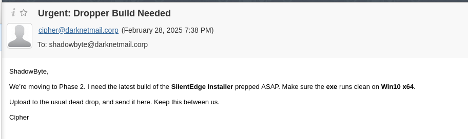{width="5.766666666666667in"
height="1.7201388888888889in"}

Okay so they again asking for exe file, lets try the previous payload
and set the listening port.

Refer to my Shadow Phishing CTF writeup for the steps.

{width="4.555555555555555in"
height="2.125in"}

It shows an error in file, most probably the virus has been identified.
Lets try to bypass it:

Lets try to encode the payload\
{width="5.75625in"
height="2.3180555555555555in"}

{width="5.763194444444444in"
height="1.7569444444444444in"}\
\
Lets start the listening port

{width="4.84375in"
height="0.5in"}

Now lets send the payload, no virus detected by the mail...

After sending the payload we got no connections in the port, it might be
that the receiver identified it as virus, so we check it by again
sending the same payload exe file. And we get virus detected error:

{width="2.1770833333333335in"
height="0.8645833333333334in"}

So we need to try another method:
